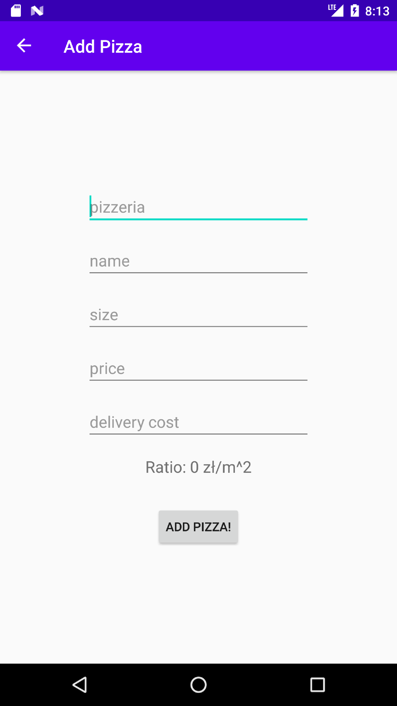
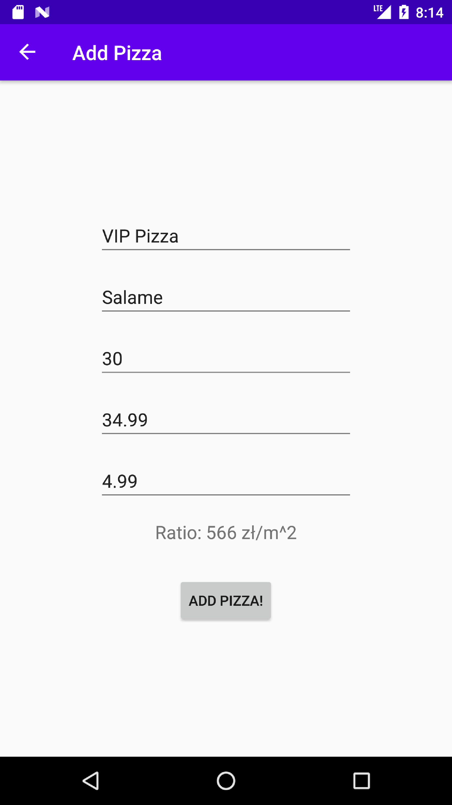
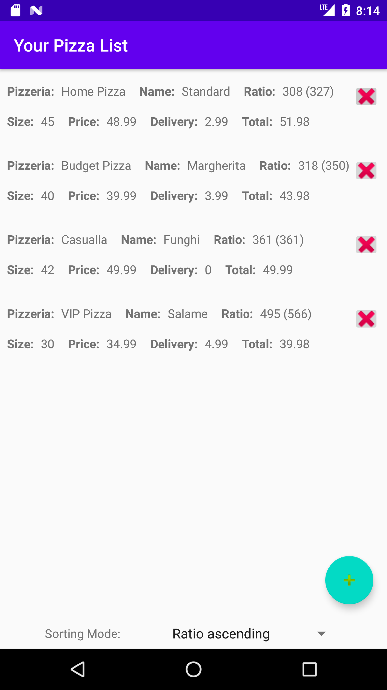

# PizzaCostCalculator

## Description

Handy Android app helping make an optimal decision when choosing pizza size.\
Project focused on high quality and proper Android architecture practices.\
Most code written using TDD, high coverage levels. Unit tests, integration tests, e2e tests.\
CI/CD made with Bitrise. SonarQube and CodeCov for metrics.\
Functionality is just a background of this project, yet still working and helpful.

## Features

- Calculating pizza price/area ratio
- Including delivery costs into calculations
- Sorting by ratio ascending/descending
- Adding/removing list entries

## Technologies

- `Kotlin`
- `Room`
- `JUnit`
- `Mockito`
- `Espresso`
- `Gradle`

and `AndroidX` stack elements such as `Navigation`, `Lifecycle`, `Fragment`, etc.

## Code Quality

### Sonar

\

\

### Code Coverage

\
\

Detailed results can be found in [jaCoCo Report][jaCoCo].

## Screenshots

  
Show screenshots

   

   <table>
      <tr>
         <td align="center">
             
            <b>Figure 1. Empty Add Form</b>
         </td>
         <td align="center">
             
            <b>Figure 2. Filled Add Form</b>
         </td>
         <td align="center">
             
            <b>Figure 3. Item List View</b>
         </td>
      </tr>
      </table>

   

[jaCoCo]: sca/app/build/reports/jacoco/testDebugUnitTestCoverage/html/index.html
